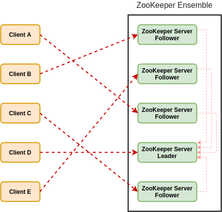
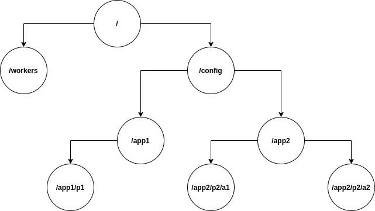
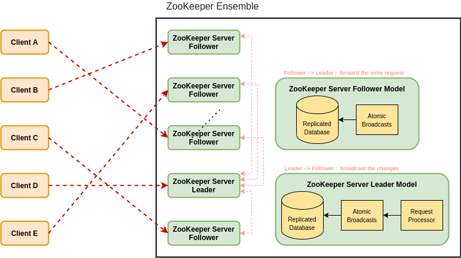

## Overview

Apache ZooKeeper is a centralized service for maintaining configuration information, naming, providing distributed synchronization, and providing group services. All of these kinds of services are used in some form or another by distributed applications. Each time they are implemented there is a lot of work that goes into fixing the bugs and race conditions that are inevitable. Because of the difficulty of implementing these kinds of services, applications initially usually skimp on them, which make them brittle in the presence of change and difficult to manage. Even when done correctly, different implementations of these services lead to management complexity when the applications are deployed.

Apache ZooKeeper aims at distilling the essence of these different services into a very simple interface to a centralized coordination service. The service itself is distributed and highly reliable. Consensus, group management, and presence protocols will be implemented by the service so that the applications do not need to implement them on their own. Application specific uses of these will consist of a mixture of specific components of ZooKeeper and application specific conventions.

### What is Apache ZooKeeper Meant For?

The common services provided by ZooKeeper -

* Configuration information management service

Latest and up-to-date configuration information of the system for a joining node.

* Naming service

Identify the nodes in a cluster by name. It's similar to DNS, but for nodes.

* Cluster group management service

Join/Leave of a node in a cluster and update node status at realtime.

* Leader election service

Elect a node as leader for coordination purpose.

* Locking and synchronization service

Locking the data while modifying it.

* Highly reliable data registry

Availability of data even when one or a few nodes are down.

### Benefits of ZooKeeper

* Simple distributed coordination process

* Synchronization

Mutual exclusion and co-operation between server processes.

* Ordered Messages

* Serialization

Encode the data according to specific rules. Ensure your application runs consistently.

* Reliability

* Atomicity

Data transfer either succeed or fail completely, but no transaction is partial.

## Fundamental Concepts of ZooKeeper

### Client-Server Architecture of ZooKeeper

* Client

Client, one of the nodes in the ``Distributed Application Cluster``, accesses information from the server. For a particular time interval, every client sends a message to the server to let the sever know that the client is alive.

Similarly, the server sends an acknowledgement when a client connects. If there is no response from the connected server, the client automatically redirects the message to another server.

* Server

Server, one of the nodes in the ``ZooKeeper Ensemble``, provides all the services to client, and gives acknowledgement to client to inform that the server is alive.

* Ensemble

Group of ZooKeeper servers. The minimum number of nodes that is required to form an ensemble is 3.

* Leader

Server node which performs automatic recovery if any of the connected node failed. Leaders are elected on service startup.

* Follower

Server node which follows leader instruction.

### Hierarchical Namespace

The following diagram depicts the tree structure of ZooKeeper file system used for memory representation. ZooKeeper node is referred as ``Znode``. Every znode is identified by a name and separated by a sequence of path (/).

In the diagram, first you have a root znode (separated by "/").

Under root, you have two logical namespaces config (separated by "/config") and workers (separated by "/workers").

The config namespace is used for centralized configuration management and the workers namespace is used for naming.

Under config namespace, each znode can store up to 1MB of data. This is similar to Unix file system except that the parent znode can store data as well. The main purpose of this structure is to store synchronized data and describe the metadata of the znode. This structure is called as ``ZooKeeper Data Model``.

Every znode in the ZooKeeper Data Model maintains a stat structure. A stat simply provides the metadata of a znode. It consists of ``Version number``, ``Action control list (ACL)``, ``Timestamp``, and ``Data length``.

* Version number

Every znode has a version number, which means every time the data associated with the znode changes, its corresponding version number would also increased.

The use of version number is important when multiple zookeeper clients are trying to perform operations over the same znode.

* Action Control List (ACL)

ACL is basically an authentication mechanism for accessing the znode. It governs all the znode read and write operations.

* Timestamp

Timestamp represents time elapsed from znode creation and modification. It is usually represented in milliseconds.

ZooKeeper identifies every change to the znodes from ``"Transaction ID" (zxid)``. Zxid is unique and maintains time for each transaction so that you can easily identify the time elapsed from one request to another request.

* Data length

Total amount of the data stored in a znode is the data length. You can store a maximum of 1MB of data.

### Types of Znode

Znodes are categorized as ``Persistence znode``, ``Ephemeral znode`` and ``Sequential znode``.

* Persistence znode

Persistence znode is alive even after the client, which created that particular znode, is disconnected.

By default, all znodes are persistent unless otherwise specified.

* Ephemeral znode

Ephemeral znode is active until the client is alive. When a client gets disconnected from the ZooKeeper ensemble, then the ephemeral znodes get deleted automatically. For this reason, only ephemeral znodes are not allowed to have a children further. 

Ephemeral znodes play an important role in ``Leader Election``, since an ephemeral znode is deleted, then the next suitable node will fill its position.

* Sequential znode

Sequential znode can be either persistent or ephemeral. When a new znode is created as a sequential znode, then ZooKeeper sets the path of the znode by attaching a 10-digit sequence number to the original name. For example, if a znode with path /myapp is created as a sequential znode, ZooKeeper will change the path to /myapp0000000001 and set the next sequence number as 0000000002.

Sequential znodes play an important role in ``Locking and Synchronization``, since two sequential znodes are created concurrently, then ZooKeeper never uses the same number for each znode.

### Sessions

Sessions are very important for the operation of ZooKeeper. Requests in a session are executed in ``FIFO order``. Once a client connects to a server, the session will be established and a session id is assigned to the client.

The client sends heartbeat at a particular time interval to keep the session valid. If the ZooKeeper ensemble does not receive heartbeat from a client for more than the period (session timeout) specified at the starting of the service, it decides that the client died.

``Session timeout`` is usually represented in milliseconds. When a session ends for any reason, the ephemeral znodes created during that session also get deleted.

### Watches

Watches are a simple mechanism for the client to get notifications about the changes in the ZooKeeper ensemble. Clients can set watches while reading a particular znode. Watches send a notification to the registered client for any of the znode (on which client registers) changes.

Znode changes are modification of data associated with the znode or changes in the znode's children. ``Watches are triggered only once``. If a client wants a notification again, it must be done through another read operation. When a connection session is expired, the client will be disconnected from the server and the associated watches are also removed.

## Workflow

Once a ZooKeeper ensemble starts, it will wait for the clients to connect. Clients will connect to one of the nodes in the ZooKeeper ensemble. It may be a leader or a follower node. Once a client is connected, the node assigns a session ID to the particular client and sends an acknowledgement to the client. If the client does not get an acknowledgment, it simply tries to connect another node in the ZooKeeper ensemble. Once connected to a node, the client will send heartbeats to the node in a regular interval to make sure that the connection is not lost.

* If a client wants to ``do read`` a particular znode, it sends a read request to the node with the znode path and the node returns the requested znode by getting it from its own database. For this reason, reads are fast in ZooKeeper ensemble.

* If a client wants to ``do wirte`` a particular znode, it sends the znode path and the data to the server. The connected server will forward the request to the leader and then the leader will reissue the write request to all the followers. If only a majority of the nodes respond successfully, then the write request will succeed and a successful return code will be sent to the client. Otherwise, the write request will fail. The strict majority of nodes is called as Quorum.

### Nodes in a ZooKeeper Ensemble

Let's analyze the effect of having different number of nodes in the ZooKeeper ensemble.

1. If we have a single node, then the ZooKeeper ensemble fails when that node fails. It contributes to “Single Point of Failure” and it is not recommended in a production environment.

2. If we have two nodes and one node fails, we don’t have majority as well, since one out of two is not a majority.

3. If we have three nodes and one node fails, we have majority and so, it is the minimum requirement. It is mandatory for a ZooKeeper ensemble to have at least three nodes in a live production environment.

4. If we have four nodes and two nodes fail, it fails again and it is similar to having three nodes. The extra node does not serve any purpose and so, it is better to add nodes in odd numbers, e.g., 3, 5, 7.

We know that a ``write process`` is expensive than a ``read process`` in ZooKeeper ensemble, since all the nodes need to write the same data in its database. So, it is better to have less number of nodes (3, 5 or 7) than having a large number of nodes for a balanced environment.

* Read

Reads are performed internally by a specific connected node, so there is no need to interact with the overall cluster.

* Write

Writes are handled by the leader node. The leader forwards the write request to all the followers and waits for answers from the majority of followers. If (more then) half of the followers reply, then the write process is complete.

* Request Processor

Present only in leader node. It governs write requests from the followers.

* Atomic broadcasts

Responsible for broadcasting the changes from the leader to the followers.

## Use the Leader Election as the Ending

Let's analyze how a leader node can be elected by a ZooKeeper ensemble.

Consider there are N number of nodes in a distributed application cluster, the process of leader election is performed as follows,

* All the nodes create ``a sequential, ephemeral znode`` with the same path, for example, "/app/leader_election/guid_".

* ZooKeeper ensemble will append the 10-digit sequence number to the path and the znode created will be "/app/leader_election/guid_0000000001", "/app/leader_election/guid_0000000002", etc.

* For a given node  which creates the smallest number in the znode becomes the leader and all the other nodes are followers.

* Each follower node watches the znode having the next smallest number. For example, the node which creates znode "/app/leader_election/guid_0000000008" will watch the znode "/app/leader_election/guid_0000000007" and the node which creates the znode "/app/leader_election/guid_0000000007" will watch the znode "/app/leader_election/guid_0000000006".

* If the leader goes down, then its corresponding znode "/app/leader_election/guid_N" gets deleted.

* The next in line follower node will get the notification through watcher about the leader removal and check if there are other znodes with the smallest number. If none, then it will assume the role of the leader. Otherwise, it finds the node which created the znode with the smallest number as leader.

* Similarly, all other follower nodes elect the node which created the znode with the smallest number as leader.
